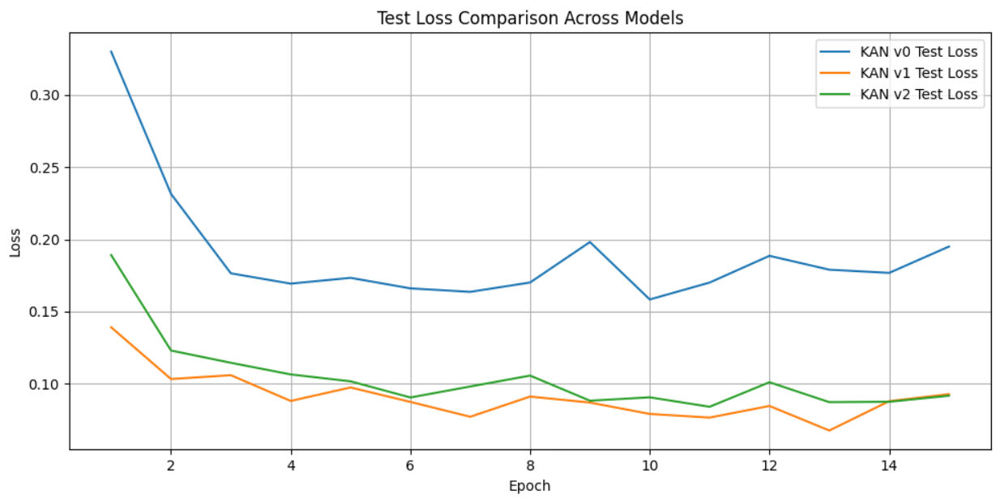
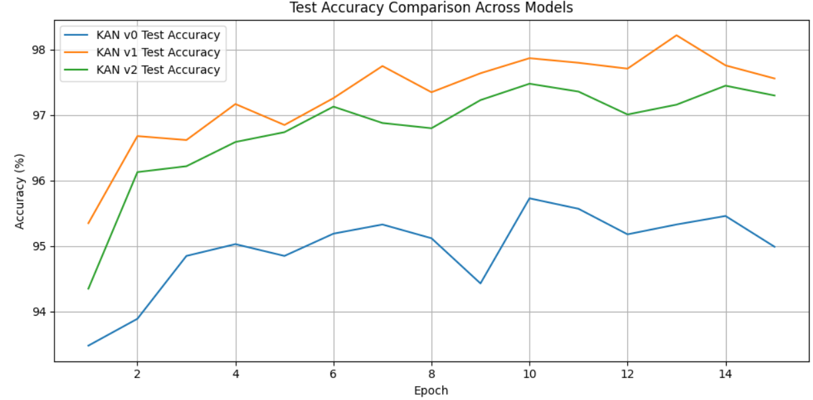
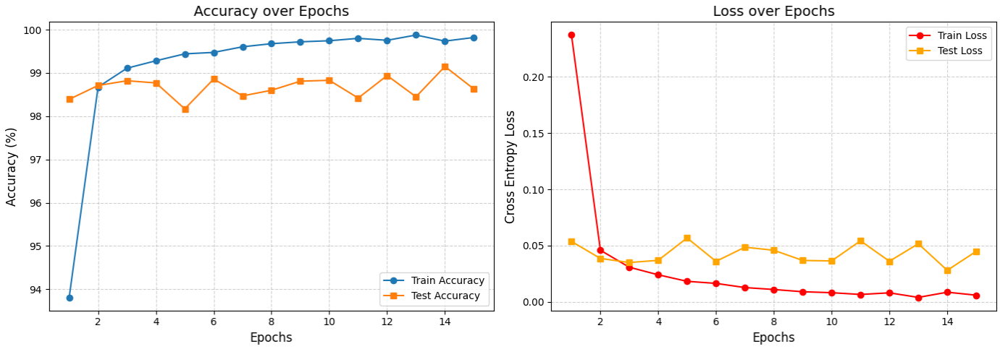

# KAN Models Performance Summary

All models were trained for **15 epochs on MNIST** using **AdamW optimization**.

# Models Implemented

## 1. Classical Model 0 - KAN v0 (Spline-Based KAN)

This is the **baseline KAN architecture** that follows the original KAN idea:  
instead of fixed activations, **learnable functions are placed on edges**.

Each edge function is parameterized using **B-spline basis functions**.

### Edge Function
$\phi_{ij}(x) = \sum_{k} c_{ijk} B_k(x)$

Where:

- \(B_k(x)\) = spline basis function  
- \(c_{ijk}\) = learnable coefficients  
- \(k\) = number of spline bases

### Architecture
784 -> KAN(64) -> LayerNorm -> ReLU

  -> KAN(32) -> LayerNorm -> ReLU

  -> Linear(10)

### Characteristics

- Fully spline-based nonlinear representation
- Demonstrates the **core idea of KAN**
- Higher parameter count due to **basis expansion per edge**

# 2. Classical Model 1 - KAN v1 (Hybrid Linear + Spline KAN)

This version improves KAN v0 by adding a **linear base path alongside the spline function**.

Instead of relying purely on splines, the model learns a **combination of linear and spline representations**.

### Edge Function

$y = w_b \cdot \text{Linear}(\text{SiLU}(x)) + w_s \cdot \text{Spline}(x)$

Where:

- \(w_b\) = base linear scale
- \(w_s\) = spline scale

### Architecture
784 -> KAN(128) -> LayerNorm

  -> KAN(64) -> LayerNorm

  -> KAN(10)

### Characteristics

- Hybrid **linear + spline representation**
- Improves **training stability**
- Higher parameter count
- Better accuracy than pure spline KAN

# 3. Classical Model 2 - KAN v2 (Chebyshev Polynomial KAN)

Instead of spline basis functions, this model uses **Chebyshev polynomials**.

Polynomial basis functions provide:

- better **numerical stability**
- smoother approximations
- fewer parameters

### Edge Function

$y = \sum W\,\sigma(x) + b + \sum_d c_d\,T_d(\tanh(x))$

Where:

- \(T_d(x)\) = Chebyshev polynomial of degree \(d\)
- \(c_d\) = trainable polynomial coefficient
- \(\tanh(x)\) = input normalization

### Architecture
784 -> ChebyKAN(64) -> LayerNorm

  -> ChebyKAN(32) -> LayerNorm

  -> ChebyKAN(10)

### Characteristics

- Uses **orthogonal polynomial basis**
- Lower parameter count
- Efficient approximation of nonlinear functions
- Strong accuracy with **lowest compute cost**

### Performance Visualizations

**Test Loss Across Model0, Model1 and Model2**

**Test Accuracy Across Model0, Model1 and Model2**

# 4. Convolutional KAN - ConvChebyKAN

This model integrates **convolutional feature extraction with Chebyshev KAN layers**.

Instead of flattening images immediately, spatial information is preserved using convolution.

### Edge Function

$y = Conv(\text{SiLU}(x), W_b) + Conv([T_0(\tanh x), T_1(\tanh x), …, T_D(\tanh x)], W_{poly})$

Where:

- \(W_b\) = base convolution weights
- \(W_{poly}\) = polynomial convolution weights

### Characteristics

- Combines **CNN inductive bias with KAN nonlinearities**
- Exploits **spatial structure of images**
- Highest accuracy among all models
- Higher compute due to convolution operations

### Performance Visualizations

**ConvChebyKAN Training Performance**

---

# Key Metrics

The following table summarizes the performance of all models after training.

| Metric                      | KAN v0   | KAN v1   | KAN v2 (Chebyshev) | ConvChebyKAN |
|-----------------------------|----------|----------|--------------------|--------------|
| **Parameters (M)**          | 0.418506 | 1.202014 | 0.263018           | 0.529066     |
| **MACs (M)**                | 0.000704 | 0.000768 | 0.000384           | 0.07552      |
| **Inference Time (ms)**     | 1.027068 | 1.518185 | 1.275876           | 1.415255     |
| **Final Test Accuracy (%)** | 94.99    | 97.56    | 97.19              | **98.63**    |
| **Final Test Loss**         | 0.1950   | 0.0928   | 0.0299             | 0.0449       |

### Metric Definitions

- **Parameters (M)**  
  Total trainable parameters (in millions).

- **MACs (M)**  
  Multiply-Accumulate operations required for one forward pass.

- **Inference Time (ms)**  
  Average time required to process one sample.

- **Final Test Accuracy (%)**  
  Classification accuracy on the MNIST test set.

- **Final Test Loss**  
  Cross-entropy loss after the final epoch.

# Observations

### Model Efficiency

- **KAN v2 (Chebyshev)** achieves strong performance with the **lowest compute cost**.
- **KAN v1** improves accuracy but increases parameter count.

### Accuracy

- **ConvChebyKAN achieves the highest accuracy (98.63%)**, likely due to convolution capturing spatial structure in images.

### Trade-offs

| Model | Strength | Limitation |
|------|------|------|
| KAN v0 | Demonstrates pure KAN concept | Lower accuracy |
| KAN v1 | Hybrid representation improves performance | Large parameter count |
| KAN v2 | Efficient polynomial representation | Slightly lower accuracy than conv |
| ConvChebyKAN | Best accuracy | Higher compute cost |
