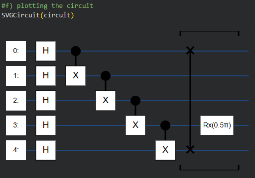
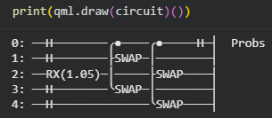

# Tasks I, II & III

This directory contains implementations and documentation for the first three tasks of the ML4Sci QMLHEP test tasks.

- [`tasks_i_ii.ipynb`](tasks_i_ii.ipynb) - Implementation notebook for Tasks I and II
- [`tasks-i-ii.pdf`](tasks-i-ii.pdf) - PDF export of Tasks I & II
- [`task-iii.md`](task-iii.md) - Open task: Quantum computing experience and research interests

## Task I: Quantum Computing

### Circuit 1: Quantum Operations (Cirq)

A five-qubit quantum circuit was implemented using Cirq to demonstrate standard quantum operations, including entanglement and single-qubit rotation. Cirq documentation and reference links were used for gate definitions and circuit visualization.

- 5 qubits initialized.
- Hadamard gate applied to every qubit.
- CNOT applied on `(0,1)`, `(1,2)`, `(2,3)`, `(3,4)`.
- SWAP applied on `(0,4)`.
- X-axis rotation by `pi/2` applied on one qubit.

- 

### Circuit 2: Swap Test Circuit (PennyLane)

A second five-qubit circuit was implemented using PennyLane to demonstrate the swap test for estimating overlap (similarity) between two quantum states. The first qubit is used as an ancilla to control swap operations.

- Hadamard gate applied to the first qubit.
- RX rotation by `pi/3` applied to the second qubit.
- Hadamard gates applied to the third and fourth qubits.
- Swap test performed between `|q1 q2>` and `|q3 q4>` using controlled-SWAP operations.

- 

## Task II: Classical Graph Neural Network (GNN)

Each jet is represented as a graph, where particles act as nodes.
Edges are constructed using k-nearest neighbors (`k=24`) to capture local particle relationships within jets.

| Model | Core Idea | Accuracy | AUC |  |
|---|---|---:|---:|---|
| ParticleNet | EdgeConv with dynamic k-NN graph construction | 0.810 | 0.889 | Best overall performance |
| Graph Attention Network (GAT) | GATConv with attention-weighted neighbor message passing | 0.798 | 0.882 | Better than standard GCN |
| Graph Convolutional Network (GCN) | Standard GCNConv neighbor aggregation | 0.796 | 0.872 | Baseline graph model |

